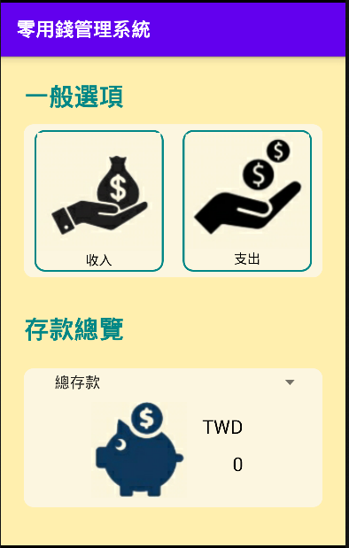
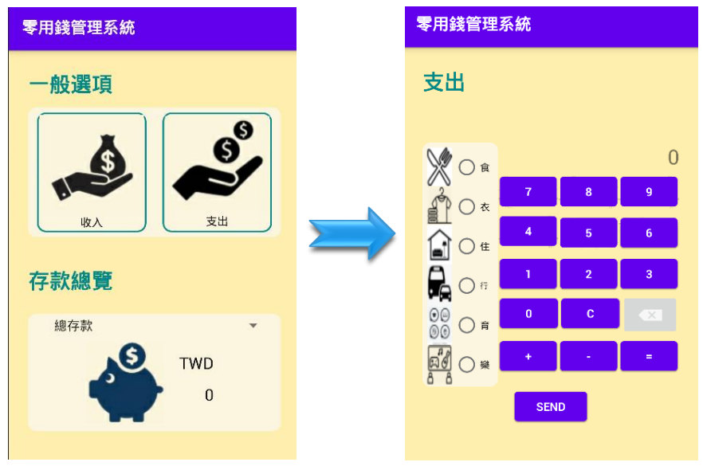
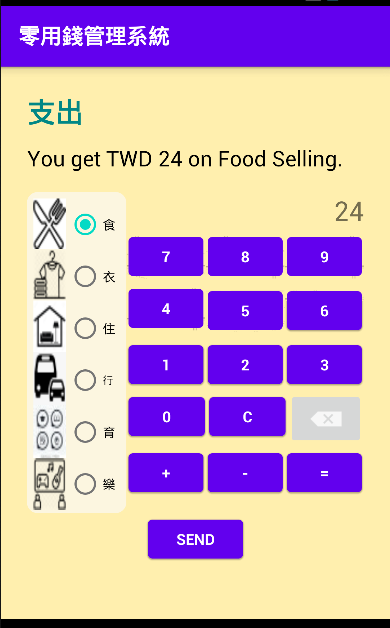
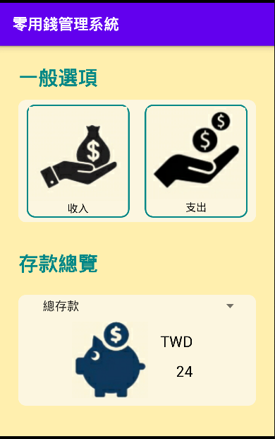
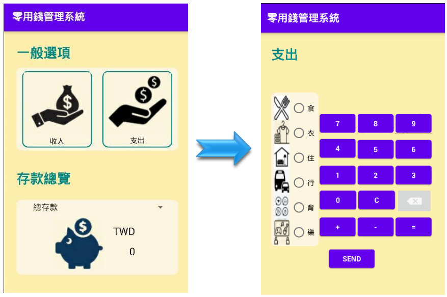
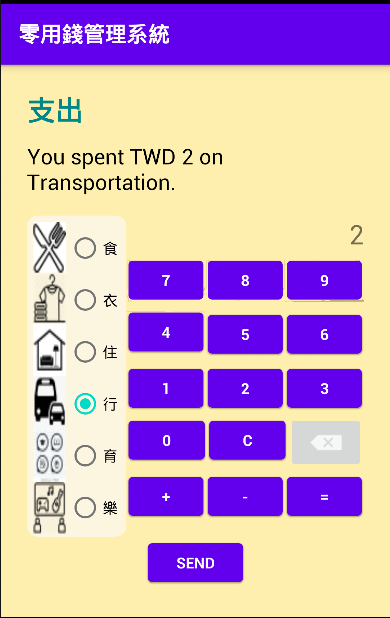
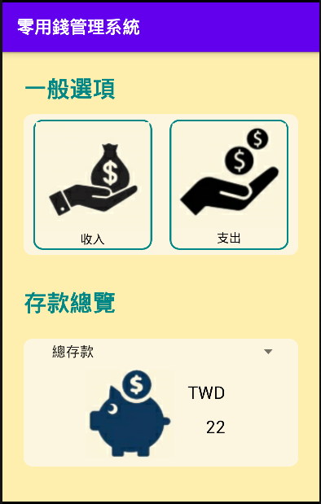
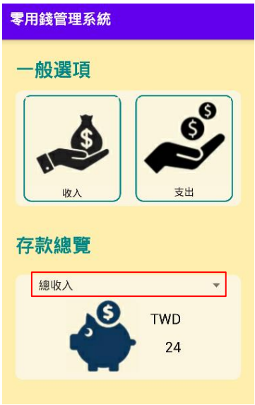
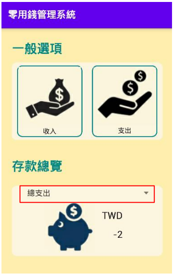

# Pocket-Money-Management-System
零用錢管理系統

## Abstract  
This work aims to develop an Android App with accounting and expenditure management functions, combined with the caulator project I established before. This app cam manually calculate income and expenditure, and the amount of money also can be added at any time in the accounting process.  
  
## Purpose of Creation  
In order to move towards wealth freedom as soon as possible, investment and financial management have become one of the necessary lessons in life. The first step in financial management is to learn money management. The most basic and easy key to getting started is bookkeeping. By developing the habit of daily bookkeeping, you can understand your money trends and spending habits, which in turn can help improve your financial sensitivity.  
In addition to the traditional paper handbook records, more and more people now choose to change to the form of mobile phone APP for bookkeeping due to the development of computers and mobile phones.  
  
## Features  
1. Money Accounting 
2. Computer Helper
3. Data Logging
  
## Instruction  
Step.01  Open the APP and enter the main screen.  
  
  
Step.02  **Revenue Accounting**  
- Press the income button at the top left of the main screen to enter the income registration page.  
    
- Select the type of income (food, clothing, housing, transportation, education, entertainment), and use the small calculator on the right to calculate the amount of income.  
- Press the "=" button, and the content entered by the user will be displayed at the top of the screen.  
    
- After confirming that it is correct, press Send to return to the main screen. The Deposit Overview block will display the total deposit amount.  
    
  
Step.03  **Expense Payments**  
- Press the expense button at the top right of the main screen to enter the expense registration page.  
    
- Select the type of income (food, clothing, housing, transportation, education, entertainment), and use the small calculator on the right to calculate the amount of expense.  
- Press the "=" button, and the content entered by the user will be displayed at the top of the screen.  
    
- After confirming that it is correct, press Send to return to the main screen. The Deposit Overview block will display the total deposit amount.  
    
  
Step.04  **View the total Income and Expenses**  
- Income: Select the Total Earnings option from the menu under Deposit Overview in the main screen to view the full amount of earnings.  
    
- Expense: Select the Total Spend option in the menu under Deposit Overview in the main screen to view the full amount of your spending.  
    

